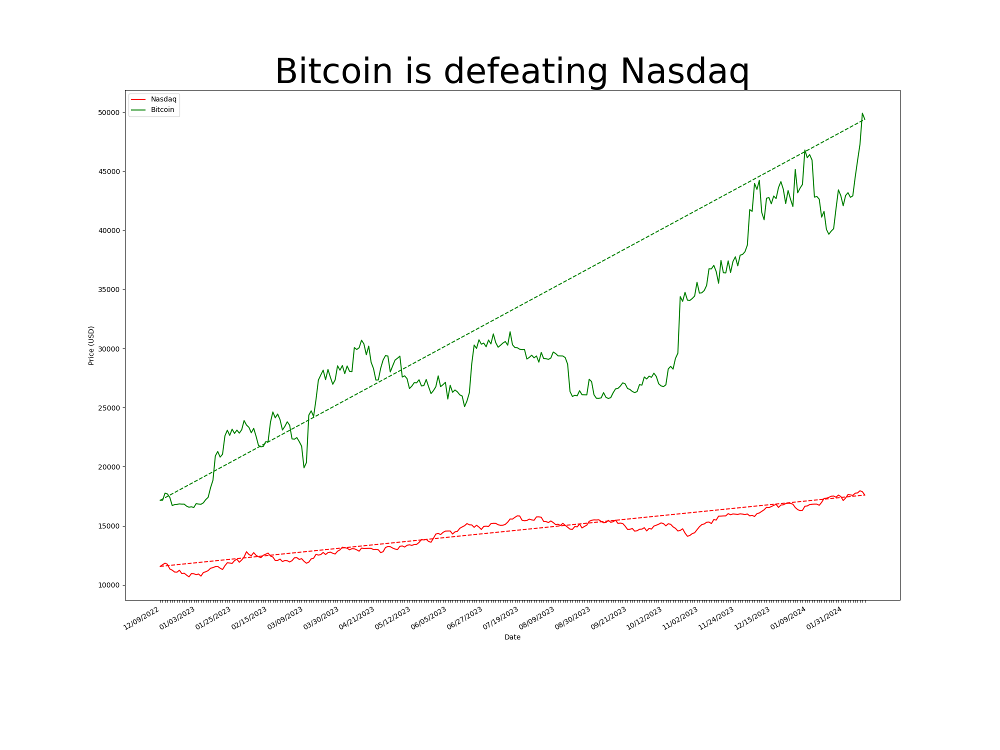
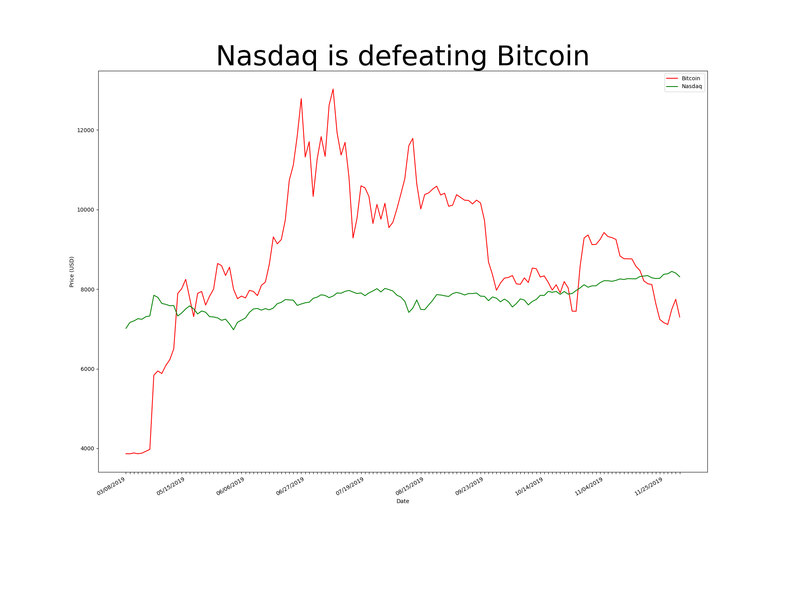

# Assignment 1

## Exercise 1

### 1.1 Current Issues

- The chart uses two pictures of bananas on plane XZ and YZ to show the chart is related to banana export which has already been shown by the caption. Too much ink is used and little information is provided, and the colors are distracting and make the whole presetation messy. It violates *less chartjunk* rules. Leave the two planes white in this case is a better practice.

- The grid lines seems useless as audiences can't accurately read the value of each bar, due to its 3-Dimensional presetation, with the camera fixed diagonally above. It violates *Minimizing non-data-int ratio*. Removing them in this case I believe is a better choice.

- The density of bars is so high that it produces *vibration(visual stress)* to users. Enlarging the space between two bars can mitigate the effect.

- According to *aesthetics* rule, graphics should usually have greater width than height. The given graphic has a longest vertical axis among three axes, which is unnatural and hard to read. Making the horizontal axes longer is a better solution

- In figure 1, though different heights of individual bars are shown, it is sometimes hard to compare the height between two neighbor bars(see figure 1.1), due to its 3-Dimensional presetation, with the camera fixed diagonally above. Changing the camera angle is a better solution.

*Figure 1.1 Comparison issues*

### 1.2 Proposed Improvement

- Using 2D plot can eliminate the situation that bars are blocked by neightbors.
- Line plot shows the data changes over time more intuitively.
- The third dimension - different countries - can be represented by high contrast colors

*Figure 1.1 Improvement proposal on banana export plot (Fake data)*

## Exercise 2

### 2.1 Bitcoin has been better than the Nasdaq

*Figure 2.1 A Plot where Bitcoin is skyrocketing*

### 2.2 The Nasdaq has been better than Bitcoin

*Figure 2.2 A plot where the Nasdaq index is steadier than Bitcoin*

### 2.3 Lie factor analysis

Both plots don't contain all the dates in the dataset, with only days when one market was overperforming the other. Figure 2.1 only shows a period when Bitcoin was skyrocketing while the Nasdaq remained flat, overesitmating the potential of Bitcoin and giving audience an illusion that Bitcoin is more worth buying.

Figure 2.2 only shows a period when Bitcoin was fluctuating drastically while the Nasdaq index was growing slowing but steadily, underesitmating the future potential of Bitcoin.

### 2.4 Fair plot

Justify current plot(Figure 2.3)

1. **Direct Price Comparison**: The graph displays the actual price movements of both Bitcoin and Nasdaq, which allows for a direct comparison of their values over time.

2. **Timeline Correlation**: By aligning both trends on the same time axis, it's possible to see how each investment responds to market events, global economic changes, and other temporal factors.

3. **Volatility Visualization**: The graph clearly shows the volatility of Bitcoin in comparison to the Nasdaq. This could be useful to highlight the investment risk or potential returns.

4. **Trend Analysis**: Investors or interested parties can observe long-term trends, such as growth or decline patterns, and how each market has performed relative to each other over the same period.

*Figure 2.3 A Plot showing Bitcoin VS the Nasdaq index from 2019-2024*

Future improvement

**Labels and Annotation**: Place labels directly next to the lines they describe, which avoids the need for a legend and reduces the cognitive load required to match colors to labels.
**Data-Dense**: Jorma could present more information in the same space. For example, adding markers for significant events could provide context for price changes.
**Color**: Use colors effectively to help distinguish data without distracting. Stick to a colorblind-friendly palette, in case Jorma’s blog has colorblind readers.
Avoid Chartjunk: No 3D or unnecessary decorative elements that don’t add informational value.
**Comparison**: Provide clear means for comparison, such as starting both Bitcoin and Nasdaq at 100% and plotting their relative change.

## Exercise 3

This is a stack plot(Figure 3.1) retrieved from The Economist 2024, March 16 Issue, demostrating the global oil production and consumption comparison

The plot is effective for several reasons:

1. **Clarity**: It clearly distinguishes between different categories (countries/groups) in global oil production and consumption with different colors, making it easy to compare them at a glance.

2. **Data over time**: The chart effectively shows changes over a period of time, allowing for the observation of trends, peaks, and troughs in both production and consumption of oil.

3. **Dual-axis**: The use of a dual y-axis (production and consumption) allows for comparison of two related datasets that share the same x-axis (time). Putting consumption volume below production volume intuitively shows the meaning of consumption and production(as plus and minus) and makes it easy to observe whether it is a surplus or a deficit.

4. **Temporal context**: The mention of USSR's contribution to the Russian data up until 1989 provides historical context which is crucial for understanding the data post-1989.

These elements combined make the visual representation of data effective for an audience to quickly grasp complex information.

*Figure 3.1 Global oil production and consumption, millions of barrels per day*

*Source:*
Oil in a dangerous climate. (2024, Mar 16). The Economist, 450, 3-3, 4. Retrieved from <https://www.proquest.com/magazines/oil-dangerous-climate/docview/2956877984/se-2>

## Exercise 4

### 4.1

Source code: <https://github.com/James-Leste/VisualizationNotebook/blob/main/exercise1/scripts/Penguin.ipynb>

*Figure 4.1 Penguin Data Comparison*
